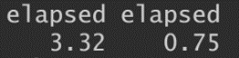
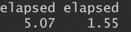

# dfr <a></a>
[](https://CRAN.R-project.org/package=dfr)
[](https://CRAN.R-project.org/package=dfr)
[](https://cran.r-project.org/package=dfr)

Implementation of the Dual Feature Reduction (DFR) approach for the Sparse Group Lasso (SGL) and the Adaptive Sparse Group Lasso (aSGL). The DFR approach is a feature reduction approach that applies strong screening to reduce the feature space before optimisation, leading to speed-up improvements for fitting SGL models. DFR is implemented using the Adaptive Three Operator Splitting (ATOS) algorithm, with linear and logistic SGL models supported, both of which can be fit using k-fold cross-validation. Dense and sparse input matrices are supported.

A detailed description of DFR can be found in [Feser, F., Evangelou, M. (2024). "Dual feature reduction for the sparse-group lasso and its adaptive variant"](https://arxiv.org/abs/2405.17094).

SGL was proposed in [Simon, N., Friedman, J., Hastie, T., Tibshirani, R. (2013). "A Sparse-Group Lasso"](https://www.tandfonline.com/doi/abs/10.1080/10618600.2012.681250).

The adaptive SGL is described in [Mendez-Civieta, A., Carmen Aguilera-Morillo, M., Lillo, R. (2020). "Adaptive sparse group LASSO in quantile regression"](https://link.springer.com/article/10.1007/s11634-020-00413-8) and [Poignard, B. (2020). "Asymptotic theory of the adaptive Sparse Group Lasso"](https://link.springer.com/article/10.1007/s10463-018-0692-7).

## Installation

You can install the current stable release from [CRAN](https://cran.r-project.org/) with
``` r
install.packages("dfr")
```
Your R configuration must allow for a working Rcpp. To install a develop the development version from GitHub run
``` r
library(devtools)
install_github("ff1201/dfr")
```

## Example

The code for fitting a basic DFR-SGL model is:

``` r
library(dfr)
groups = c(rep(1:20, each=3),
           rep(21:40, each=4),
           rep(41:60, each=5),
           rep(61:80, each=6),
           rep(81:100, each=7))

data = sgs::gen_toy_data(p=500, n=400, groups = groups, seed_id=3)

model = dfr_sgl(X = data$X, y = data$y, groups = groups, alpha = 0.95)
```

where `X` is the input matrix, `y` the response vector, `groups` a vector containing indices for the groups of the predictors, and `alpha` determines the convex balance between the lasso and group lasso.

The impact of screening can be seen by turning off the screening rules:

``` r
no_screen = system.time(model <- dfr_sgl(X = data$X, y = data$y, groups = groups, alpha = 0.95,screen=FALSE))
screen = system.time(model_screen <- dfr_sgl(X = data$X, y = data$y, groups = groups, alpha = 0.95,screen=TRUE))
c(no_screen[3], screen[3])
```

For DFR-aSGL, run

``` r
library(dfr)
groups = c(rep(1:20, each=3),
           rep(21:40, each=4),
           rep(41:60, each=5),
           rep(61:80, each=6),
           rep(81:100, each=7))

data = sgs::gen_toy_data(p=500, n=400, groups = groups, seed_id=3)

model = dfr_adap_sgl(X = data$X, y = data$y, groups = groups, alpha = 0.95, gamma_1 = 0.1, gamma_2 = 0.1)
```
where `gamma_1` and `gamma_2` determine the shape of the adaptive penalties. Again, we can see the impact of screening

``` r
no_screen = system.time(model <- dfr_adap_sgl(X = data$X, y = data$y, groups = groups, alpha = 0.95, gamma_1 = 0.1, gamma_2 = 0.1, screen=FALSE))
screen = system.time(model_screen <- dfr_adap_sgl(X = data$X, y = data$y, groups = groups, alpha = 0.95, gamma_1 = 0.1, gamma_2 = 0.1, screen=TRUE))
c(no_screen[3], screen[3])
```
